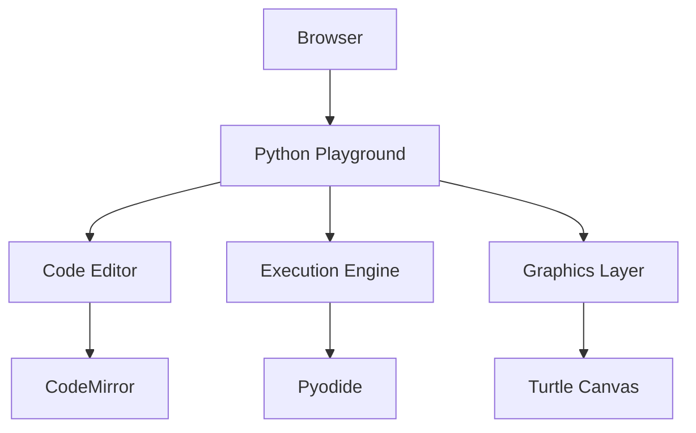

Interactive Python coding playground with Pyodide integration and turtle graphics visualization. Run Python code directly in your browser with real-time execution and visual output.

## Features
- 🧠 **Pyodide Integration**: Run Python in WebAssembly with full interpreter capabilities
- 🖋️ **CodeMirror Editor**: Syntax highlighting and code completion
- 🐢 **Turtle Graphics**: Visual programming with SVG-based turtle rendering
- 🎨 **Theme Support**: Dracula, Solarized, and GitHub themes
- 🧪 **Testing Framework**: Comprehensive unit and integration tests
- 🔐 **Security**: Sandboxed execution with CSP and memory limits

## Architecture


## Installation
```bash
# Clone the repository
git clone https://github.com/yourusername/python-playground.git
cd python-playground

# Install dependencies
npm install
```

## Usage
1. Start the development server:
```bash
npm start
```

2. Open your browser at `http://localhost:3000`

3. Write Python code:
```python
import turtle
turtle.forward(100)
turtle.right(90)
turtle.forward(100)
```

4. Click "Run" to see the turtle graphics output

## Customization
- **Themes**: Switch between Dracula, Solarized, and GitHub themes
- **Languages**: Add JavaScript, HTML, or other languages with simple configuration
- **Extensions**: Add Pyodide packages for extended functionality

## Security
- Web worker isolation for code execution
- Content Security Policy (CSP) enforcement
- Memory usage limits and execution timeouts

## Documentation
- [English Documentation](python-playground-documentation.md)
- [Deutsche Dokumentation](python-playground-documentation-de.md)

## Contributing
1. Fork the repository
2. Create your feature branch
3. Commit your changes
4. Push to the branch
5. Open a pull request

## License
MIT License - see [LICENSE](LICENSE) for details

---

Made with ❤️ by [Your Name](https://github.com/yourusername)

## Examples
- `examples/turtle_demo.py` — simple turtle graphics demo that you can paste into the editor and run using the playground's Pyodide-backed runtime.
- Tip: If the playground does not expose a full `time.sleep`, wrap pauses in try/except as shown in the example.

</final_file_content>
