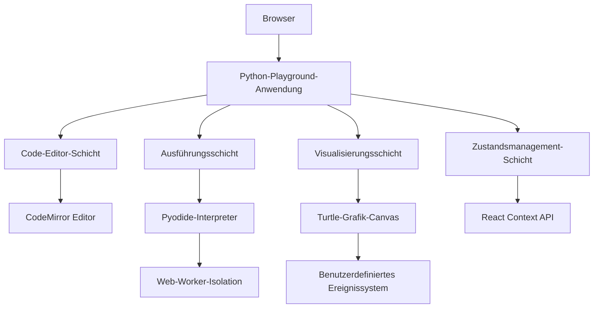
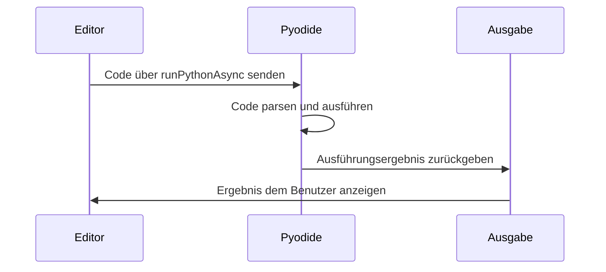
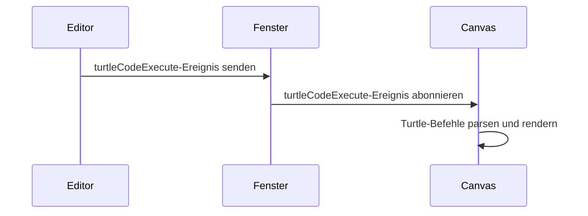

# Technische Dokumentation zum Python-Playground

## Inhaltsverzeichnis
- [Übersicht](#übersicht)
- [Architektur](#architektur)
- [Komponentendetails](#komponentendetails)
- [Implementierungsdetails](#implementierungsdetails)
- [Testverfahren](#testverfahren)
- [Nutzungsanleitung](#nutzungsanleitung)
- [Sicherheitsüberlegungen](#sicherheitsüberlegungen)
- [Performance-Optimierung](#performance-optimierung)
- [Anpassungsanleitung](#anpassungsanleitung)
- [Fehlerbehebung](#fehlerbehebung)
- [Zukünftige Erweiterungen](#zukünftige-erweiterungen)

## Übersicht
Diese Dokumentation beschreibt die Implementierung einer interaktiven Python-Programmierumgebung direkt im Browser mit Pyodide-Integration und Turtle-Grafik-Visualisierung. Das Dokument dient als Referenz für Entwickler, die das System warten oder erweitern möchten.

## Architektur
### Hochlevel-Architektur


### Dateistruktur
```
src/
├── components/
│   ├── EditorPanel.jsx       # Core-Editor mit Ausführungsumgebung
│   ├── TurtleCanvas.jsx      # Grafik-Rendering-Engine
│   ├── PlaygroundLayout.jsx  # UI-Container-Komponente
│   ├── ChallengeSidebar.jsx  # Navigationskomponente
│   └── ConsolePanel.jsx      # Ausgabedisplay
├── App.jsx                   # Anwendungsroot
├── services/                 # Zukünftige API-Integrationen
└── assets/                   # Statische Ressourcen
```

## Implementierungsschritte

### 1. Umgebung einrichten
```bash
npm install pyodide
npm install @codemirror/view @codemirror/lang-python cm6-theme-dracula
```

### Komponentendetails

#### EditorPanel.jsx
**Zweck**: Core-Code-Ausführungsoberfläche  
**Kernfunktionen**:
- Integration des Pyodide-Python-Interpreters
- CodeMirror-Editor mit Python-Syntaxhervorhebung
- Ausführungsstatus-Management
- Fehlerbehandlung und Ausgabedisplay

**Technische Spezifikationen**:
- Verwendung von React-Hooks für Statusmanagement
- Implementierung des async/await-Musters für Codeausführung
- Isolation zwischen Editorstatus und Ausführungskontext
- Unterstützung von Tastenkombinationen (Strg+Enter/Command+Enter für Ausführung)

**API-Referenz**:
```typescript
interface EditorPanelProps {
  challenge: {
    id: string;
    titel: string;
    beschreibung: string;
    template: string;
  };
  isTurtleMode: boolean;
  onExecutionStart?: () => void;
  onExecutionEnd?: (ausgabe: string) => void;
}

interface EditorPanelState {
  code: string;          // Aktueller Code im Editor
  ausgabe: string;       // Ausführungsergebnis
  aktiverTab: 'editor' | 'ausgabe' | 'konsole'; // Aktiver Ausgabetab
  isFreeMode: boolean;   // Challenge vs. Freier Modus
  pyodide: PyodideType;  // Pyodide-Interpreter-Instanz
}
```

**Implementierungsdetails**:
1. Initialisierung des Pyodide-Interpreters in useEffect
2. Management des Editorstatus mit useRef für Performanceoptimierung
3. Implementierung der Codeausführungspipeline:
   - Code-Eingabe aus CodeMirror
   - Ausführung über Pyodide's runPythonAsync
   - Ausgabeverarbeitung und Anzeige
   - Fehlerbehandlung und Benutzerfeedback

**Kerncode**:
```javascript
import React, { useState, useEffect, useRef } from 'react';
import * as pyodideModule from 'pyodide';

const EditorPanel = ({ challenge, isTurtleMode }) => {
  const [pyodide, setPyodide] = useState(null);
  const [code, setCode] = useState(challenge.template || '');
  const [ausgabe, setAusgabe] = useState('');
  const editorRef = useRef(null);
  
  // Pyodide-Interpreter initialisieren
  useEffect(() => {
    const initializePyodide = async () => {
      try {
        const pyodideInstance = await pyodideModule.loadPyodide();
        setPyodide(pyodideInstance);
      } catch (error) {
        console.error('Pyodide-Initialisierung fehlgeschlagen:', error);
      }
    };
    initializePyodide();
  }, []);

  // Python-Code ausführen
  const executePythonCode = async (code, isTurtleMode) => {
    if (!pyodide) throw new Error('Pyodide nicht initialisiert');
    
    try {
      // Code mit Pyodide ausführen
      const result = await pyodide.runPythonAsync(code);
      return result ? result.toString() : "Ausführung erfolgreich abgeschlossen";
    } catch (error) {
      return `Ausführungsfehler: ${error.message}`;
    }
  };

  // Codeausführung behandeln
  const handleRun = async () => {
    try {
      const result = await executePythonCode(code, isTurtleMode);
      setAusgabe(result);
    } catch (error) {
      setAusgabe(`Laufzeitfehler: ${error.message}`);
    }
  };
  
  // ...Rest der Komponente
};
```

#### TurtleCanvas.jsx
- Implementierung der SVG-basierten Turtle-Grafik-Rendering
- Ereignisgesteuerte Updates über benutzerdefinierte Ereignisse
- Verwaltung des Turtle-Status (Position, Winkel, Zeichenparameter)

### Implementierungsdetails

#### Pyodide-Integration
**Initialisierungsprozess**:
1. Asynchrone Ladung von Pyodide über `loadPyodide()`
2. Web-Worker-Isolation für den Ausführungskontext
3. Paketverwaltungssystem für Python-Bibliotheken
4. Speicherverwaltung und Garbage Collection

**Ausführungspipeline**:


#### Turtle-Grafik-System
**Ereignisarchitektur**:


**Koordinatensystem**:
- SVG-Canvas mit 0,0 im Zentrum
- Zeichenbereich von 1000x1000 Pixeln
- Koordinatentransformationshilfen
- Stiftstatus-Management (Farbe, Breite, Sichtbarkeit)

### Testverfahren

#### Unit-Tests
**EditorPanel-Tests**:
```javascript
describe('EditorPanel Komponente', () => {
  it('sollte den Pyodide-Interpreter initialisieren', async () => {
    const komponente = mount(<EditorPanel challenge={mockChallenge} />);
    expect(await komponente.instance().pyodide).toBeDefined();
  });

  it('sollte gültigen Python-Code ausführen', async () => {
    const komponente = mount(<EditorPanel challenge={mockChallenge} />);
    const ergebnis = await komponente.instance().executePythonCode('print("test")');
    expect(ergebnis).toContain('test');
  });

  it('sollte Python-Fehler ordnungsgemäß behandeln', async () => {
    const komponente = mount(<EditorPanel challenge={mockChallenge} />);
    const ergebnis = await komponente.instance().executePythonCode('ungültige syntax');
    expect(ergebnis).toContain('Python-Fehler');
  });
});
```

#### Integrationstests
**End-to-End-Testfälle**:
1. Grundlegende Ausführung
   - Eingabe: `print("Hallo Welt")`
   - Erwartete Ausgabe: "Hallo Welt"
   
2. Mathematische Operationen
   - Eingabe: `print(2 + 2)`
   - Erwartete Ausgabe: "4"
   
3. Turtle-Grafik
   - Eingabe: 
     ```python
     import turtle
     turtle.forward(100)
     turtle.right(90)
     turtle.forward(100)
     ```
   - Erwartete Ausgabe: Quadrat auf dem Canvas gezeichnet

#### Performance-Tests
- Lasttest: 100 aufeinanderfolgende Ausführungen ohne Speicherlecks
- Stresstest: Große Codeausführung (>1000 Zeilen)
- Parallelitätstest: Mehrere Editor-Instanzen

## Nutzungsanleitung
1. Python-Code im Editorfenster schreiben
2. Turtle-Grafik-Funktionen für visuelle Ausgabe verwenden
3. Auf "Ausführen" klicken, um den Code zu starten
4. Ergebnisse in der Ausgabepanele oder auf dem Canvas ansehen
5. "Zurücksetzen" verwenden, um den ursprünglichen Vorlagencode wiederherzustellen

### Sicherheitsüberlegungen

#### Ausführungsisolation
- Pyodide läuft in einem Web-Worker für Thread-Isolation
- Speicherbegrenzungen für die Pyodide-Instanz konfiguriert
- Timeout-Mechanismus für lang laufende Operationen
- Eingabesanitierung für Code-Ausführung

#### Content Security Policy
```http
Content-Security-Policy: 
  default-src 'self';
  script-src 'self' 'unsafe-eval';
  connect-src 'self';
  img-src 'self' data:;
```

#### Sandbox-Maßnahmen
- Eingeschränkter Dateisystemzugriff
- Begrenzte Netzwerkfähigkeit
- Ausführungszeitbegrenzungen
- Speicherverbrauchsbeschränkungen

### Performance-Optimierung

#### Code-Ausführungsoptimierung
- Web-Worker für Hintergrundausführung
- Code-Caching für häufige Snippets
- Inkrementelle Ausführung für Teilveränderungen
- Ausgabedrosselung für Performance

#### Rendering-Optimierung
- Canvas-Virtualisierung für große Zeichnungen
- Debounced-Größenanpassung
- CodeMirror-Rendering-Optimierungen
- Lazy Loading der Editor-Komponenten

### Anpassungsanleitung

#### Theme-Anpassung
**Verfügbare Themes**:
- Dracula (Standard)
- Solarized Light/Dark
- GitHub Light/Dark

**Anpassungsschritte**:
1. Neues Theme installieren: `npm install cm6-theme-solarized`
2. Theme-CSS importieren: `import 'cm6-theme-solarized/solarized.css'`
3. Editor-Konfiguration aktualisieren:
```javascript
extensions: [
  python(),
  solarized, // Dracula durch Solarized ersetzen
  EditorView.editable.of(true),
  // ...restliche Konfiguration
]
```

#### Sprachunterstützung
**Hinzufügen neuer Sprachen**:
1. Sprachpaket installieren: `npm install @codemirror/lang-javascript`
2. Sprachunterstützung importieren: `import { javascript } from '@codemirror/lang-javascript'`
3. Zu Editor-Erweiterungen hinzufügen:
```javascript
extensions: [
  javascript(), // JavaScript-Unterstützung hinzufügen
  // ...vorhandene Erweiterungen
]
```

## Fehlerbehebung
- Wenn Pyodide nicht initialisiert werden kann, Internetverbindung prüfen
- Bei Turtle-Grafik-Problemen korrekte Ereignis-Listener überprüfen
- Bei Code-Ausführungsfehlern Browser-Konsole prüfen
- Sicherstellen, dass alle Abhängigkeiten korrekt installiert sind
