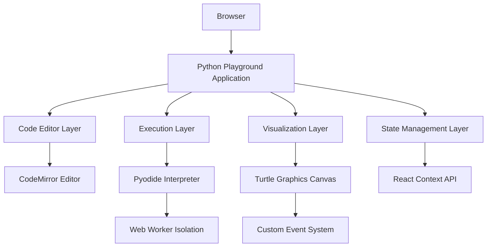
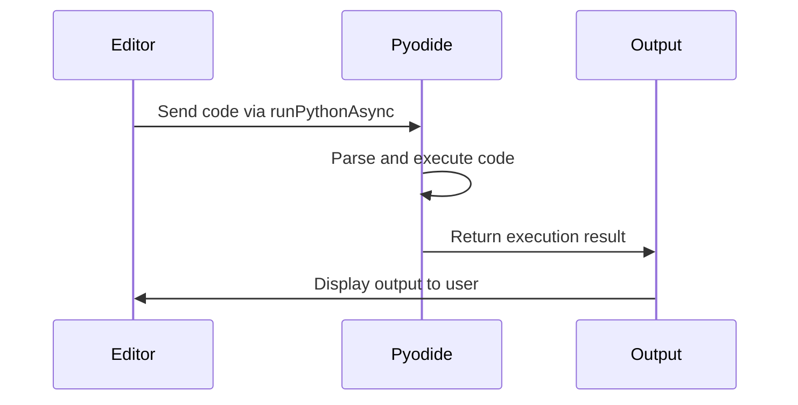
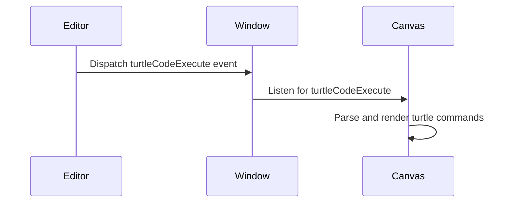

# Python Playground Technical Documentation

## Table of Contents
- [Overview](#overview)
- [Architecture](#architecture)
- [Component Details](#component-details)
- [Implementation Details](#implementation-details)
- [API Reference](#api-reference)
- [Testing Procedures](#testing-procedures)
- [Usage Guide](#usage-guide)
- [Security Considerations](#security-considerations)
- [Performance Optimization](#performance-optimization)
- [Customization Guide](#customization-guide)
- [Troubleshooting](#troubleshooting)
- [Future Enhancements](#future-enhancements)

## Overview
This document provides comprehensive technical documentation for the Python playground web application. The playground enables interactive Python coding directly in the browser with real-time execution capabilities and turtle graphics visualization. This documentation serves as a reference for developers maintaining or extending the system.

## Architecture
### High-Level Architecture


### File Structure
```
src/
├── components/
│   ├── EditorPanel.jsx       # Core editor with execution engine
│   ├── TurtleCanvas.jsx      # Graphics rendering engine
│   ├── PlaygroundLayout.jsx  # UI container component
│   ├── ChallengeSidebar.jsx  # Navigation component
│   └── ConsolePanel.jsx      # Output display component
├── App.jsx                   # Application root
├── services/                 # Future API integrations
└── assets/                   # Static resources
```

## Implementation Steps

### 1. Environment Setup
```bash
npm install pyodide
npm install @codemirror/view @codemirror/lang-python cm6-theme-dracula
```

### Component Details

#### EditorPanel.jsx
**Purpose**: Core code execution interface
**Key Features**:
- Pyodide-based Python interpreter integration
- CodeMirror editor with Python syntax highlighting
- Execution state management
- Error handling and output display

**Technical Specifications**:
- Uses React hooks for state management
- Implements async/await pattern for code execution
- Maintains isolation between editor state and execution context
- Supports keyboard shortcuts (Ctrl+Enter/Cmd+Enter for execution)

**API Reference**:
```typescript
interface EditorPanelProps {
  challenge: {
    id: string;
    title: string;
    description: string;
    template: string;
  };
  isTurtleMode: boolean;
  onExecutionStart?: () => void;
  onExecutionEnd?: (output: string) => void;
}

interface EditorPanelState {
  code: string;          // Current code in editor
  output: string;        // Execution output
  activeTab: 'editor' | 'output' | 'console'; // Active output tab
  isFreeMode: boolean;   // Challenge vs Free mode state
  pyodide: PyodideType;  // Pyodide interpreter instance
}
```

**Implementation Details**:
1. Initializes Pyodide interpreter in useEffect
2. Manages editor state with useRef for performance optimization
3. Implements code execution pipeline:
   - Code input from CodeMirror
   - Execution via Pyodide's runPythonAsync
   - Output processing and display
   - Error handling and user feedback

**Key Code**:
```javascript
import React, { useState, useEffect, useRef } from 'react';
import * as pyodideModule from 'pyodide';

const EditorPanel = ({ challenge, isTurtleMode }) => {
  const [pyodide, setPyodide] = useState(null);
  const [code, setCode] = useState(challenge.template || '');
  const [output, setOutput] = useState('');
  const editorRef = useRef(null);
  
  // Initialize Pyodide interpreter
  useEffect(() => {
    const initializePyodide = async () => {
      try {
        const pyodideInstance = await pyodideModule.loadPyodide();
        setPyodide(pyodideInstance);
      } catch (error) {
        console.error('Pyodide initialization failed:', error);
      }
    };
    initializePyodide();
  }, []);

  // Execute Python code
  const executePythonCode = async (code, isTurtleMode) => {
    if (!pyodide) throw new Error('Pyodide not initialized');
    
    try {
      // Execute code with Pyodide
      const result = await pyodide.runPythonAsync(code);
      return result ? result.toString() : "Execution completed successfully";
    } catch (error) {
      return `Execution error: ${error.message}`;
    }
  };

  // Handle code execution
  const handleRun = async () => {
    try {
      const result = await executePythonCode(code, isTurtleMode);
      setOutput(result);
    } catch (error) {
      setOutput(`Runtime error: ${error.message}`);
    }
  };
  
  // ...rest of component
};
```

#### TurtleCanvas.jsx
- Implemented SVG-based turtle graphics rendering
- Added event-driven updates through custom events
- Maintained state for turtle position, angle, and drawing parameters

### Implementation Details

#### Pyodide Integration
**Initialization Process**:
1. Asynchronous loading of Pyodide via `loadPyodide()`
2. Web worker isolation for execution context
3. Package management system for Python libraries
4. Memory management and garbage collection

**Execution Pipeline**:


#### Turtle Graphics System
**Event Architecture**:


**Coordinate System**:
- SVG canvas with 0,0 at center
- 1000x1000 pixel drawing area
- Coordinate transformation utilities
- Pen state management (color, width, visibility)

### Testing Procedures

#### Unit Testing
**EditorPanel Tests**:
```javascript
describe('EditorPanel Component', () => {
  it('should initialize Pyodide interpreter', async () => {
    const component = mount(<EditorPanel challenge={mockChallenge} />);
    expect(await component.instance().pyodide).toBeDefined();
  });

  it('should execute valid Python code', async () => {
    const component = mount(<EditorPanel challenge={mockChallenge} />);
    const result = await component.instance().executePythonCode('print("test")');
    expect(result).toContain('test');
  });

  it('should handle Python errors gracefully', async () => {
    const component = mount(<EditorPanel challenge={mockChallenge} />);
    const result = await component.instance().executePythonCode('invalid syntax');
    expect(result).toContain('Python error');
  });
});
```

#### Integration Testing
**End-to-End Test Cases**:
1. Basic Execution
   - Input: `print("Hello World")`
   - Expected Output: "Hello World"
   
2. Mathematical Operations
   - Input: `print(2 + 2)`
   - Expected Output: "4"
   
3. Turtle Graphics
   - Input: 
     ```python
     import turtle
     turtle.forward(100)
     turtle.right(90)
     turtle.forward(100)
     ```
   - Expected Output: Square drawn on canvas

#### Performance Testing
- Load Test: 100 consecutive executions without memory leaks
- Stress Test: Large code execution (>1000 lines)
- Concurrency Test: Multiple editor instances

## Usage Guide
1. Write Python code in the editor panel
2. Use turtle graphics functions for visual output
3. Click "Run" to execute code
4. View results in output panel or canvas
5. Use "Reset" to restore initial template code

### Security Considerations

#### Execution Isolation
- Pyodide runs in web worker for thread isolation
- Memory limits configured for Pyodide instance
- Timeout mechanism for long-running operations
- Input sanitization for code execution

#### Content Security Policy
```http
Content-Security-Policy: 
  default-src 'self';
  script-src 'self' 'unsafe-eval';
  connect-src 'self';
  img-src 'self' data:;
```

#### Sandboxing Measures
- Restricted filesystem access
- Limited network capabilities
- Execution time limits
- Memory usage restrictions

### Performance Optimization

#### Code Execution Optimization
- Web worker for background execution
- Code caching for frequent snippets
- Incremental execution for partial changes
- Output throttling for performance

#### Rendering Optimization
- Canvas virtualization for large drawings
- Debounced resize handling
- CodeMirror rendering optimizations
- Lazy loading of editor components

### Customization Guide

#### Theme Customization
**Available Themes**:
- Dracula (default)
- Solarized Light/Dark
- GitHub Light/Dark

**Customization Steps**:
1. Install new theme: `npm install cm6-theme-solarized`
2. Import theme CSS: `import 'cm6-theme-solarized/solarized.css'`
3. Update editor configuration:
```javascript
extensions: [
  python(),
  solarized, // Replace dracula with solarized
  EditorView.editable.of(true),
  // ...rest of configuration
]
```

#### Language Support
**Adding New Languages**:
1. Install language package: `npm install @codemirror/lang-javascript`
2. Import language support: `import { javascript } from '@codemirror/lang-javascript'`
3. Add to editor extensions:
```javascript
extensions: [
  javascript(), // Add JavaScript support
  // ...existing extensions
]
```

## Troubleshooting
- If Pyodide fails to initialize, check internet connection
- For turtle graphics issues, verify proper event listeners
- For code execution errors, check browser console
- Ensure all dependencies are properly installed
