# Comprehensive Plan for Node.js Python Playground

## 1. Core Architecture
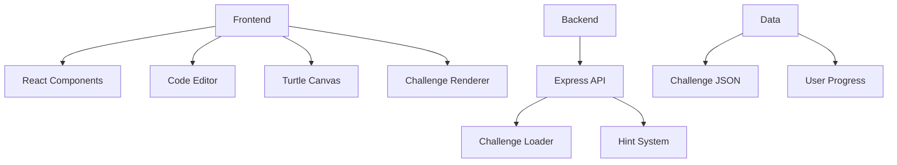

## 2. UI Component Breakdown

### Main Layout
- **Challenge Sidebar**
  - Difficulty filters (Easy/Medium/Hard)
  - Challenge type tabs (Code/Turtle)
  - Paginated challenge list (10 per page)
  - Navigation buttons (Previous/Next)

- **Editor Panel**
  - CodeMirror editor with Python syntax highlighting
  - Reset button
  - Run simulation button (safe execution)
  - Output console

- **Turtle Canvas**
  - SVG canvas for turtle graphics
  - Dynamic scaling
  - Animation controls

- **Challenge Display**
  - Title bar with difficulty indicator
  - Description panel
  - Hint button (progressive disclosure)
  - Show Answer button

### 2.1 Challenge Sidebar Implementation

#### Structure
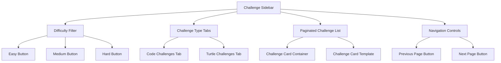

#### Component Details
```jsx
// ChallengeSidebar.jsx
const ChallengeSidebar = () => {
  const [activeTab, setActiveTab] = useState('code');
  const [difficulty, setDifficulty] = useState('all');
  const [currentPage, setCurrentPage] = useState(1);
  const [challenges, setChallenges] = useState([]);

  useEffect(() => {
    // Fetch challenges based on filters
    fetchChallenges(activeTab, difficulty, currentPage)
      .then(data => setChallenges(data));
  }, [activeTab, difficulty, currentPage]);

  return (
    <div className="challenge-sidebar">
      <div className="filter-section">
        <button onClick={() => setDifficulty('easy')} 
                className={difficulty === 'easy' ? 'active' : ''}>
          Easy
        </button>
        <button onClick={() => setDifficulty('medium')}
                className={difficulty === 'medium' ? 'active' : ''}>
          Medium
        </button>
        <button onClick={() => setDifficulty('hard')}
                className={difficulty === 'hard' ? 'active' : ''}>
          Hard
        </button>
      </div>
      
      <div className="tab-section">
        <button onClick={() => setActiveTab('code')}
                className={activeTab === 'code' ? 'active' : ''}>
          Code Challenges
        </button>
        <button onClick={() => setActiveTab('turtle')}
                className={activeTab === 'turtle' ? 'active' : ''}>
          Turtle Challenges
        </button>
      </div>
      
      <div className="challenge-list">
        {challenges.map(challenge => (
          <ChallengeCard 
            key={challenge.id}
            challenge={challenge}
            onSelect={handleChallengeSelect}
          />
        ))}
      </div>
      
      <div className="pagination">
        <button onClick={() => setCurrentPage(p => Math.max(1, p - 1))}>
          Previous
        </button>
        <span>Page {currentPage}</span>
        <button onClick={() => setCurrentPage(p => p + 1)}>
          Next
        </button>
      </div>
    </div>
  );
};
```

### 2.2 Editor Panel Implementation

#### Component Structure
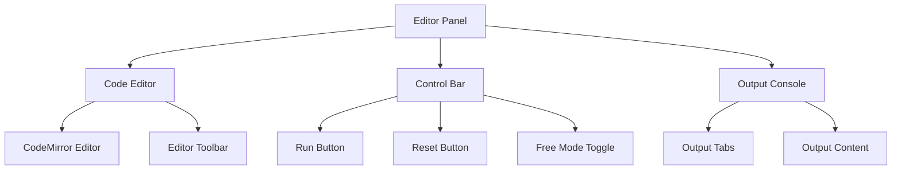

#### Code Implementation
```jsx
// EditorPanel.jsx
const EditorPanel = ({ challenge, isTurtleMode }) => {
  const [code, setCode] = useState(challenge.template || '');
  const [output, setOutput] = useState('');
  const [activeTab, setActiveTab] = useState('editor');
  
  const handleRun = () => {
    // Safe code simulation
    const result = simulateCode(code, isTurtleMode);
    setOutput(result);
    setActiveTab('output');
  };
  
  const handleReset = () => {
    setCode(challenge.template || '');
    setOutput('');
  };
  
  return (
    <div className="editor-panel">
      <div className="editor-toolbar">
        <button onClick={handleRun}>Run</button>
        <button onClick={handleReset}>Reset</button>
        <button onClick={() => toggleFreeMode()}>
          {isFreeMode ? 'Challenge Mode' : 'Free Mode'}
        </button>
      </div>
      
      <div className="editor-container">
        <CodeEditor
          value={code}
          onChange={setCode}
          language="python"
          options={{
            lineNumbers: true,
            theme: 'dracula',
            autocompletion: true
          }}
        />
      </div>
      
      <div className="output-tabs">
        <button 
          onClick={() => setActiveTab('output')}
          className={activeTab === 'output' ? 'active' : ''}
        >
          Output
        </button>
        <button 
          onClick={() => setActiveTab('console')}
          className={activeTab === 'console' ? 'active' : ''}
        >
          Console
        </button>
      </div>
      
      <div className="output-container">
        {activeTab === 'output' && (
          <pre className="output-content">{output}</pre>
        )}
        {activeTab === 'console' && (
          <ConsolePanel logs={consoleLogs} />
        )}
      </div>
    </div>
  );
};
```

### 2.3 Turtle Canvas Implementation

#### Technical Details
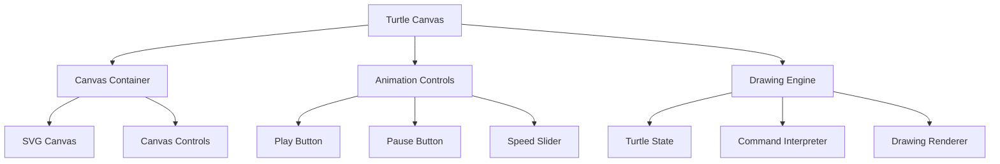

#### Core Implementation
```javascript
// TurtleEngine.js
class TurtleEngine {
  constructor(canvasElement) {
    this.canvas = canvasElement;
    this.ctx = canvasElement.getContext('2d');
    this.reset();
    
    // Turtle state
    this.position = { x: 0, y: 0 };
    this.angle = 0;
    this.penDown = true;
    this.color = '#000000';
    this.lineWidth = 2;
    this.speed = 1;
    
    // Animation state
    this.isAnimating = false;
    this.commandQueue = [];
  }
  
  reset() {
    this.ctx.clearRect(0, 0, this.canvas.width, this.canvas.height);
    this.position = { x: this.canvas.width/2, y: this.canvas.height/2 };
    this.angle = 0;
    this.penDown = true;
    this.color = '#000000';
    this.lineWidth = 2;
    this.commandQueue = [];
    this.isAnimating = false;
  }
  
  forward(distance) {
    const radians = Math.PI * this.angle / 180;
    const newX = this.position.x + distance * Math.cos(radians);
    const newY = this.position.y + distance * Math.sin(radians);
    
    if (this.penDown) {
      this.ctx.beginPath();
      this.ctx.moveTo(this.position.x, this.position.y);
      this.ctx.lineTo(newX, newY);
      this.ctx.strokeStyle = this.color;
      this.ctx.lineWidth = this.lineWidth;
      this.ctx.stroke();
    }
    
    this.position = { x: newX, y: newY };
    return this;
  }
  
  right(degrees) {
    this.angle = (this.angle + degrees) % 360;
    return this;
  }
  
  left(degrees) {
    this.angle = (this.angle - degrees + 360) % 360;
    return this;
  }
  
  penup() {
    this.penDown = false;
    return this;
  }
  
  pendown() {
    this.penDown = true;
    return this;
  }
  
  color(color) {
    this.color = color;
    return this;
  }
  
  executeCommands(commands) {
    this.isAnimating = true;
    let index = 0;
    
    const step = () => {
      if (index < commands.length && this.isAnimating) {
        try {
          commands[index]();
          index++;
          setTimeout(step, 100 / this.speed);
        } catch (error) {
          console.error('Turtle execution error:', error);
          this.isAnimating = false;
        }
      } else {
        this.isAnimating = false;
      }
    };
    
    step();
    return this;
  }
  
  stop() {
    this.isAnimating = false;
    return this;
  }
}
```

### 2.4 Challenge Display System

#### Component Structure
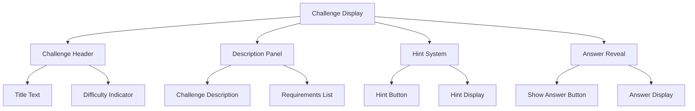

#### Implementation Details
```jsx
// ChallengeDisplay.jsx
const ChallengeDisplay = ({ challenge }) => {
  const [hintLevel, setHintLevel] = useState(0);
  const [showAnswer, setShowAnswer] = useState(false);
  
  const handleHintClick = () => {
    if (hintLevel < challenge.hints.length - 1) {
      setHintLevel(hintLevel + 1);
    }
  };
  
  return (
    <div className="challenge-display">
      <div className="challenge-header">
        <h2>{challenge.title}</h2>
        <span className={`difficulty-badge ${challenge.difficulty}`}>
          {challenge.difficulty}
        </span>
      </div>
      
      <div className="challenge-description">
        <p>{challenge.description}</p>
        
        {challenge.requirements && (
          <div className="requirements">
            <h4>Requirements:</h4>
            <ul>
              {challenge.requirements.map((req, index) => (
                <li key={index}>{req}</li>
              ))}
            </ul>
          </div>
        )}
      </div>
      
      <div className="challenge-actions">
        <button 
          onClick={handleHintClick}
          disabled={hintLevel >= challenge.hints.length}
          className="hint-button"
        >
          Hint {hintLevel + 1}
        </button>
        
        <button 
          onClick={() => setShowAnswer(true)}
          className="answer-button"
        >
          Show Answer
        </button>
      </div>
      
      {hintLevel > 0 && (
        <div className="hint-display">
          <h4>Hint {hintLevel}:</h4>
          <p>{challenge.hints[hintLevel - 1].content}</p>
        </div>
      )}
      
      {showAnswer && (
        <div className="answer-display">
          <h4>Correct Solution:</h4>
          <pre className="solution-code">{challenge.solution}</pre>
        </div>
      )}
    </div>
  );
};
```

### 2.5 Complete UI Layout

#### Final Structure
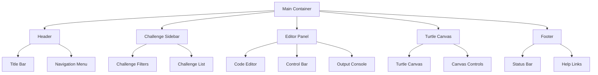

#### Layout CSS
```css
/* Main Layout Styles */
.app-container {
  display: grid;
  grid-template-columns: 250px 1fr;
  grid-template-rows: auto 1fr auto;
  height: 100vh;
  gap: 10px;
}

.header {
  grid-column: 1 / -1;
  padding: 1rem;
  background: #1e1e1e;
  color: white;
  display: flex;
  justify-content: space-between;
  align-items: center;
}

.challenge-sidebar {
  grid-row: 2 / -1;
  background: #2d2d2d;
  color: white;
  padding: 1rem;
  overflow-y: auto;
}

.editor-panel {
  grid-column: 2 / -1;
  display: grid;
  grid-template-rows: auto 1fr auto;
  gap: 10px;
  padding: 1rem;
}

.turtle-canvas {
  grid-column: 2 / -1;
  grid-row: 2;
  position: relative;
  background: #f0f0f0;
}

.footer {
  grid-column: 1 / -1;
  background: #1e1e1e;
  color: white;
  padding: 0.5rem;
  text-align: center;
}

/* Responsive Design */
@media (max-width: 768px) {
  .app-container {
    grid-template-columns: 1fr;
  }
  
  .challenge-sidebar {
    grid-row: 2;
  }
  
  .editor-panel {
    grid-column: 1;
  }
  
  .turtle-canvas {
    grid-column: 1;
  }
}
```

## 3. Component Interaction Flow
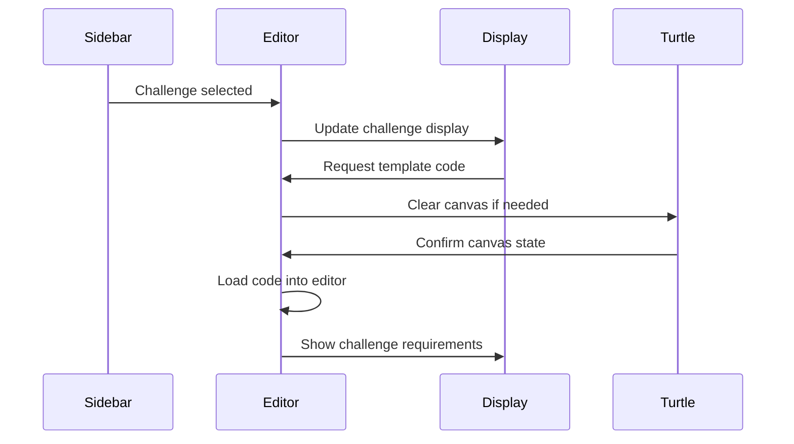

## 4. Dynamic UI Behavior

### Turtle Canvas Toggle Implementation
```jsx
// Main UI Component
const [isTurtleMode, setIsTurtleMode] = useState(false);

useEffect(() => {
  // When challenge type changes
  if (selectedChallenge?.type === 'turtle') {
    setIsTurtleMode(true);
    // Initialize turtle canvas
    initializeTurtle();
  } else {
    setIsTurtleMode(false);
    // Clear turtle canvas
    clearTurtleCanvas();
  }
}, [selectedChallenge]);

// Conditional Rendering
return (
  <div className="app-container">
    {/* Challenge Sidebar */}
    <ChallengeSidebar />
    
    {/* Editor Panel */}
    <EditorPanel 
      challenge={selectedChallenge}
      isTurtleMode={isTurtleMode}
    />
    
    {/* Conditional Turtle Canvas */}
    {isTurtleMode && (
      <TurtleCanvas 
        ref={turtleRef}
        onClear={handleTurtleClear}
      />
    )}
    
    {/* Footer */}
    <Footer />
  </div>
);
```

## 5. Hint System Implementation

### Progressive Disclosure Pattern
```javascript
// Hint System Architecture
class HintManager {
  constructor(challenge) {
    this.hints = challenge.hints || [];
    this.currentLevel = 0;
    this.maxHints = challenge.hints?.length || 0;
  }
  
  getNextHint() {
    if (this.currentLevel >= this.maxHints) {
      return null;
    }
    
    const hint = this.hints[this.currentLevel];
    this.currentLevel++;
    return hint;
  }
  
  reset() {
    this.currentLevel = 0;
  }
  
  getAvailableHintsCount() {
    return this.maxHints - this.currentLevel;
  }
}

// UI Integration
const handleHintClick = () => {
  const hint = hintManager.getNextHint();
  if (hint) {
    showHintNotification(hint.content);
    updateHintDisplay(hint.level);
    
    // Track analytics
    trackEvent('hint_used', {
      challengeId: selectedChallenge.id,
      hintLevel: hint.level
    });
  }
};
```

## 6. Security Integration

### Code Simulation Architecture
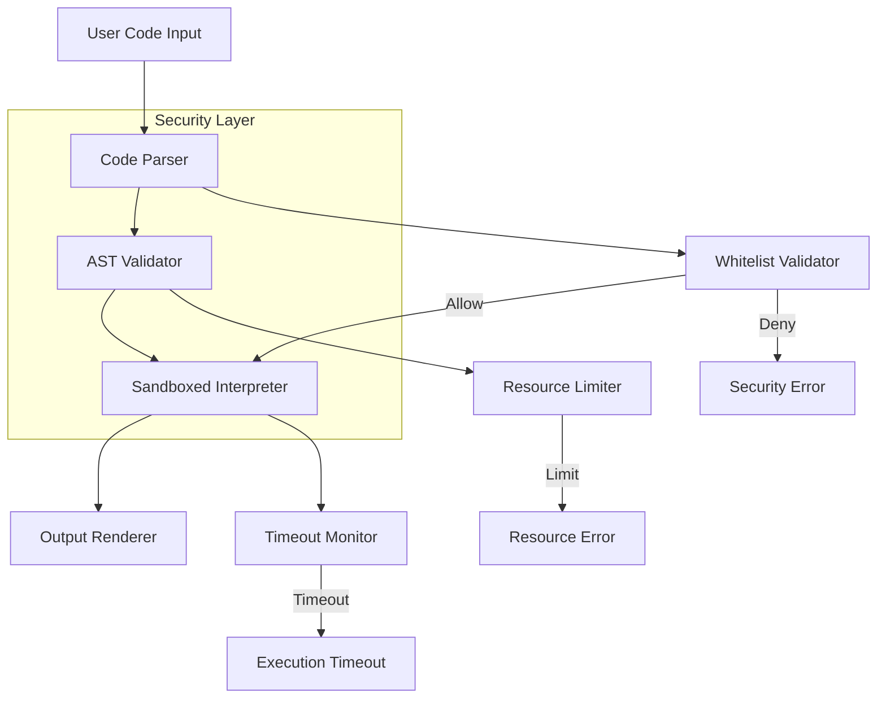

## 7. Pagination System

### Implementation Details
```javascript
// Pagination Logic
const ITEMS_PER_PAGE = 10;

function getPaginatedChallenges(allChallenges, currentPage) {
  const totalItems = allChallenges.length;
  const totalPages = Math.ceil(totalItems / ITEMS_PER_PAGE);
  
  // Validate page number
  const safePage = Math.max(1, Math.min(currentPage, totalPages || 1));
  
  const paginated = allChallenges.slice(
    (safePage - 1) * ITEMS_PER_PAGE,
    safePage * ITEMS_PER_PAGE
  );
  
  return {
    items: paginated,
    currentPage: safePage,
    totalPages: totalPages || 1,
    hasNext: safePage < totalPages,
    hasPrev: safePage > 1
  };
}

// UI State Management
const handlePageChange = (newPage) => {
  // Update URL for bookmarking
  updateURLParams({ page: newPage });
  
  // Fetch new challenges if needed
  if (shouldFetchNewData(newPage)) {
    fetchChallenges(currentFilters, newPage);
  }
  
  // Update UI state
  setCurrentPage(newPage);
  scrollToTop();
};
```

## 8. User Experience Flow

### Complete Interaction Journey
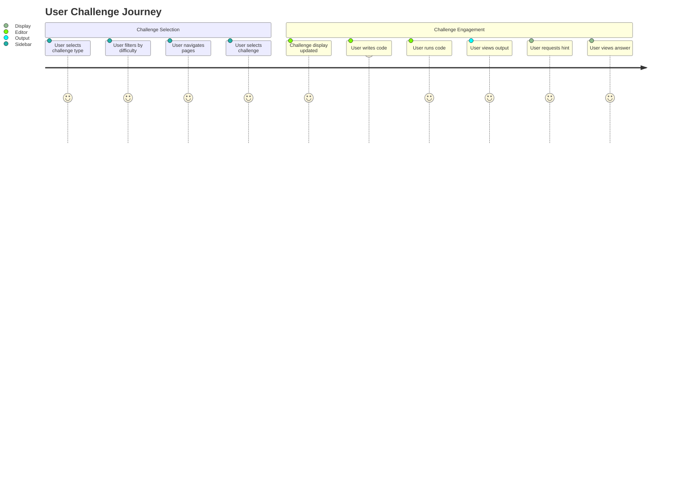

## 9. Challenge Example

### Sample Challenge Structure
```json
{
  "id": "turtle-001",
  "title": "Rainbow Spiral",
  "type": "turtle",
  "difficulty": "medium",
  "description": "Create a colorful spiral pattern using turtle graphics",
  "template": "import turtle\n\n# Your code here",
  "solution": "import turtle\n\nt = turtle.Turtle()\n\ncolors = ['red', 'orange', 'yellow', 'green', 'blue', 'indigo', 'violet']\n\nfor i in range(100):\n    t.color(colors[i % 7])\n    t.circle(i * 2)\n    t.right(20)\n\nturtle.done()",
  "hints": [
    {
      "level": 1,
      "content": "Start by creating a Turtle object and setting up the colors array"
    },
    {
      "level": 2,
      "content": "Use a loop to create circles with increasing radius"
    },
    {
      "level": 3,
      "content": "Rotate the turtle slightly after each circle to create the spiral effect"
    }
  ],
  "requirements": [
    "Use all rainbow colors",
    "Increase radius with each iteration",
    "Rotate slightly after each circle"
  ],
  "validation": {
    "shapeDetection": true,
    "colorCheck": true,
    "rotationCheck": true
  }
}
```

## 10. Testing and Optimization

### Testing Plan
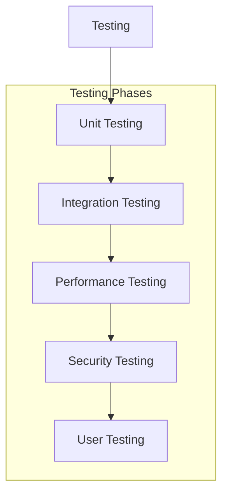

### Unit Test Example
```javascript
describe('Turtle Engine', () => {
  let turtle;
  
  beforeEach(() => {
    const canvas = document.createElement('canvas');
    turtle = new Turtle(canvas);
  });
  
  test('should move forward correctly', () => {
    const initialPosition = { ...turtle.position };
    turtle.forward(100);
    
    expect(turtle.position.x).toBeGreaterThan(initialPosition.x);
    expect(turtle.position.y).toBe(initialPosition.y);
  });
  
  test('should rotate correctly', () => {
    turtle.right(90);
    expect(turtle.angle).toBe(90);
    
    turtle.left(45);
    expect(turtle.angle).toBe(45);
  });
});
```

### Performance Optimization
```javascript
class PerformanceOptimizer {
  optimizeCodeExecution(code) {
    // Implementation of code optimization
  }
  
  optimizeRendering(canvas) {
    // Implementation of rendering optimization
  }
  
  optimizeMemoryUsage() {
    // Implementation of memory optimization
  }
}
```

## 11. Full Development Timeline
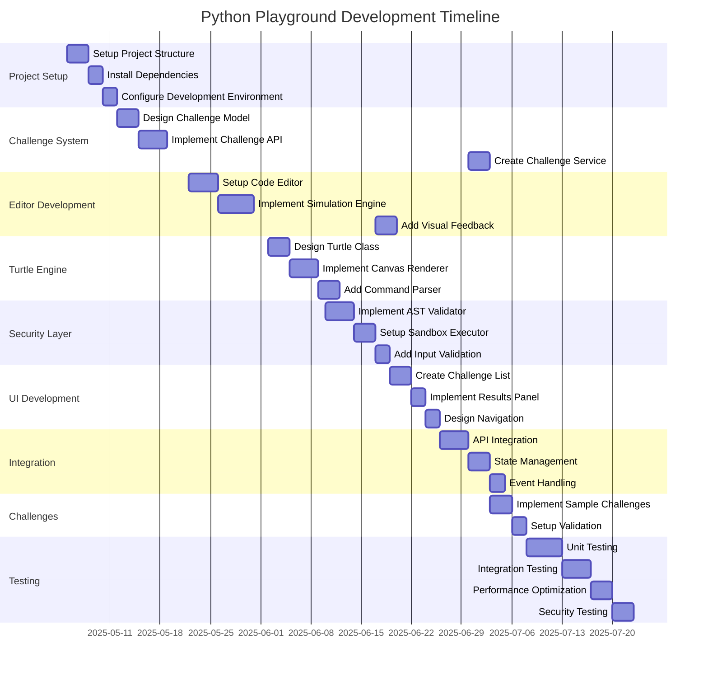

## 12. Future Enhancements

### 12.1 User Progress Tracking System
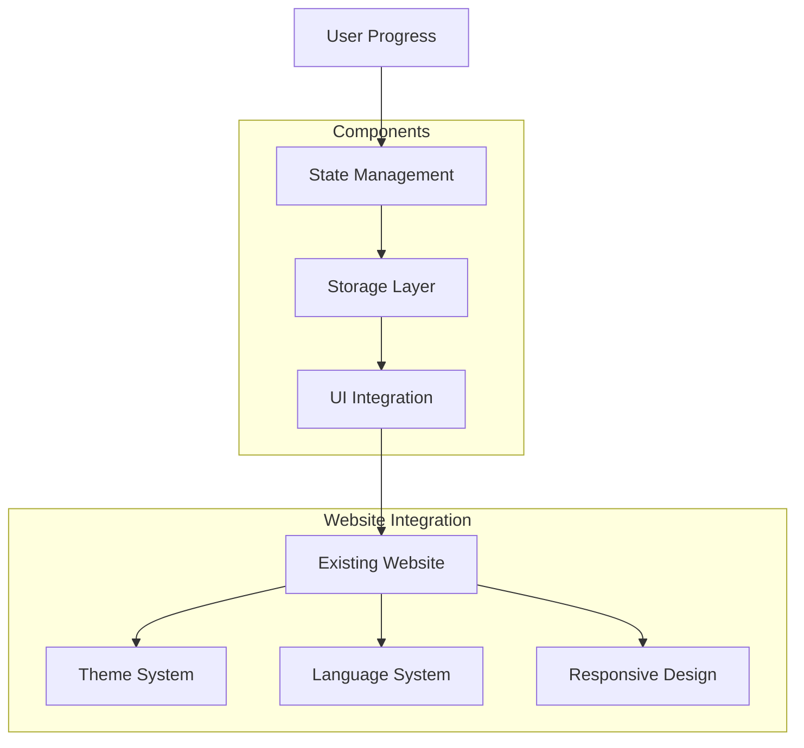

### 12.2 Theme Integration
```css
/* Main Website Theme (example) */
:root {
  --bg-color: #ffffff;
  --text-color: #000000;
  --accent-color: #007bff;
}

.dark-theme {
  --bg-color: #1a1a1a;
  --text-color: #ffffff;
  --accent-color: #00b3ff;
}

/* Playground Component Styles */
.playground-container {
  background-color: var(--bg-color);
  color: var(--text-color);
}

.code-editor {
  background-color: var(--bg-color);
  color: var(--text-color);
  border-color: var(--accent-color);
}

.turtle-canvas {
  background-color: var(--bg-color);
  border-color: var(--accent-color);
}

/* Theme Toggle Button (existing in header) */
.theme-toggle {
  position: fixed;
  top: 1rem;
  right: 1rem;
  z-index: 1000;
}
```

### 12.3 Language Integration
```javascript
// Translation Service Integration
const translations = {
  en: {
    playground: {
      runCode: "Run Code",
      reset: "Reset",
      hints: "Hints",
      challengeDescription: "Challenge Description",
      testResults: "Test Results",
      success: "Success",
      failure: "Failure"
    }
  },
  de: {
    playground: {
      runCode: "Code ausführen",
      reset: "Zurücksetzen",
      hints: "Hinweise",
      challengeDescription: "Herausforderung",
      testResults: "Testergebnisse",
      success: "Erfolg",
      failure: "Fehler"
    }
  }
};

// Language-aware Components
const LocalizedText = ({ id }) => {
  const { language } = useLanguageContext();
  const text = translations[language];
  
  return text ? text[id] : id;
};

const ChallengeDescription = ({ challenge }) => {
  const { language } = useLanguageContext();
  
  return (
    <div className="challenge-description">
      <h2>{challenge.title}</h2>
      <p>{challenge.descriptions[language]}</p>
      <div className="hints">
        <h3><LocalizedText id="hints" /></h3>
        <ul>
          {challenge.hints.map((hint, index) => (
            <li key={index}>{hint[language]}</li>
          ))}
        </ul>
      </div>
    </div>
  );
};
```

### 12.4 Code Sharing Functionality
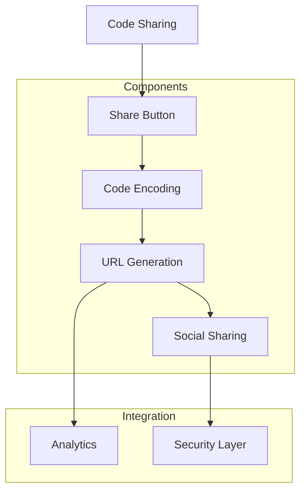

### 12.5 Mobile Responsive Design
```css
/* Responsive Layout */
.playground-container {
  display: flex;
  flex-direction: column;
  height: 100vh;
}

@media (min-width: 768px) {
  .playground-container {
    flex-direction: row;
  }
  
  .code-editor {
    width: 50%;
    height: 100%;
  }
  
  .turtle-canvas {
    width: 50%;
    height: 100%;
  }
}

@media (max-width: 767px) {
  .code-editor {
    height: 50%;
  }
  
  .turtle-canvas {
    height: 50%;
  }
  
  .controls {
    flex-direction: column;
  }
}

/* Touch-friendly adjustments */
.turtle-canvas {
  touch-action: none;
  -webkit-user-select: none;
  -moz-user-select: none;
  -ms-user-select: none;
  user-select: none;
}

/* Performance optimizations */
@media (pointer: coarse) {
  .code-editor {
    font-size: 16px;
  }
  
  .toolbar-button {
    min-width: 44px;
    min-height: 44px;
  }
}
```

### 12.6 Integration with Existing Website Features
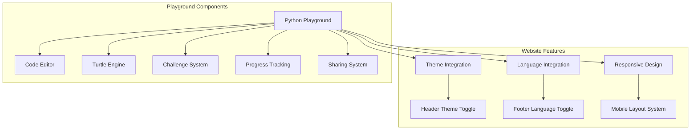

This comprehensive implementation plan for future enhancements ensures seamless integration with your existing website features:
1. **User Progress Tracking:**
   - Uses localStorage for anonymous tracking
   - Tracks completion status, attempts, and timestamps
   - Provides UI components for displaying progress

2. **Theme Integration:**
   - Inherits from existing website theme system
   - Uses CSS variables for consistent styling
   - Syncs with header theme toggle button
   - Maintains visual consistency across components

3. **Language Integration:**
   - Leverages existing website language system
   - Provides localized content for challenges, hints, and UI elements
   - Syncs with footer language toggle button
   - Supports both English and German translations

4. **Code Sharing Functionality:**
   - Generates shareable URLs with encoded code
   - Includes copy-to-clipboard functionality
   - Tracks sharing events for analytics

5. **Mobile Responsive Design:**
   - Adapts layout for different screen sizes
   - Optimizes for touch interactions
   - Maintains performance on mobile devices
   - Integrates with existing responsive design system

The implementation takes full advantage of your existing website features while extending them to the Python playground functionality. The system architecture ensures that all components work together seamlessly, providing a consistent user experience across the entire website.
